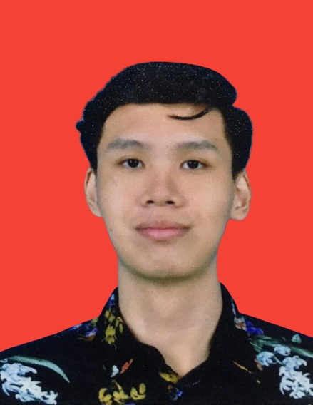
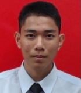

# ABOUT YOUR TUMOR CORPORATION SDN. BHD.
A group of eager UTeM students that are interested in AI founded this startup. They are passionate about AI software and products and want to make AI more widely available for people

Based in Malacca, Malaysia. 

## OUR MISSION
Introduce cutting-edge artificial intelligence (AI) technology to daily life and the community.

## Innovation
We alter people's attitudes toward AI and alter their daily routines.

## OUR TEAM
**CHIEF EXECUTIVE OFFICIAL (CEO)**

**MUHAMMAD AFIQ ASYRAF BIN ABU SAMAH**

Resposiblity:
1. Control the workforce and operations of the company.
2. Making important business decisions 
3. Manage and distribute the company's resources.
4. Aim to complete the project by the deadline.

 

**CHIEF OPERATING OFFICIAL (COO)**

**NUR AFIQAH BINTI ANUAR**

Responsibility:
1. Report any project progress and status immediately to the CEO.
2. Identify potential hazards and threats to the company.
3. Helps the CEO attend public events and network with more individuals in the neighbourhood
4. Keep the company's other members in the public eye.

 

**CHIEF TECHNOLOGY OFFICIAL (CTO)**

**MUHAMMAD AIMAN BIN REDUAN**

Responsiblity:
1. Make a choice regarding the required car-plate recognition technology.
2. Create a policy for the business to ensure a secure environment for production and development.
3. Make sure to communicate at all levels to ensure that the project and the ideas can be completed.
4. Manage the company's technical team and divide the work according to their areas of expertise

